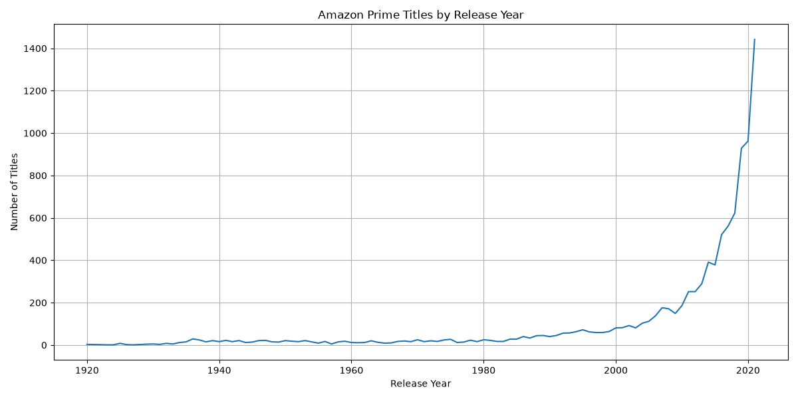
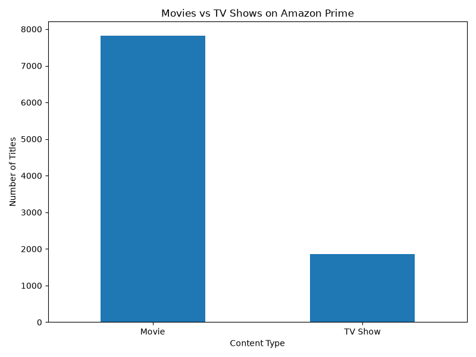
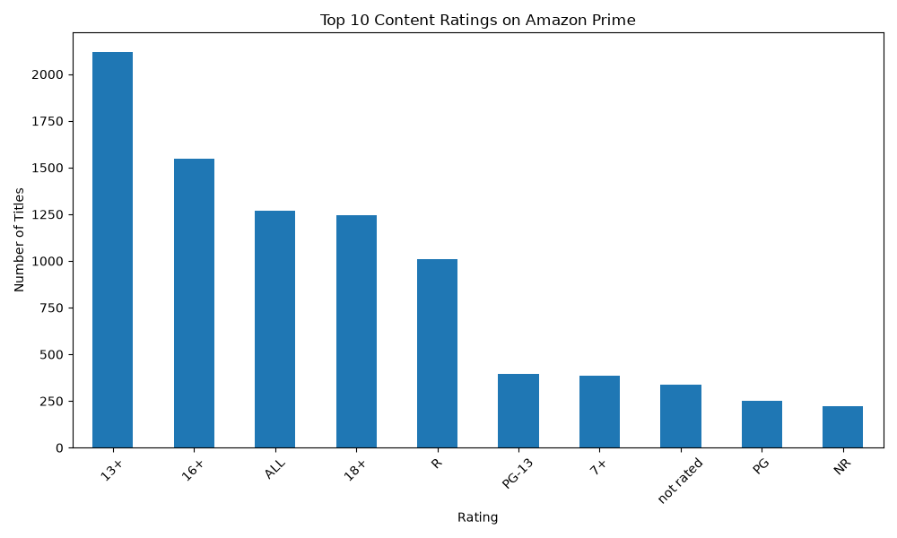
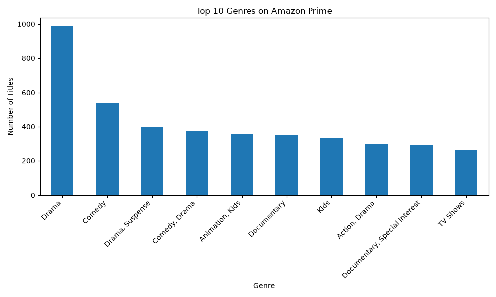
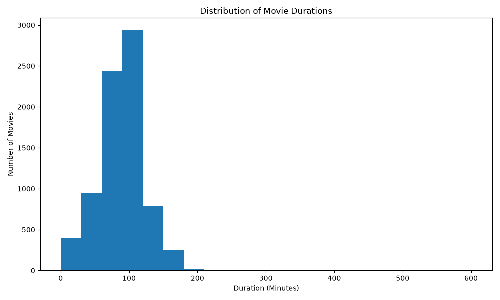
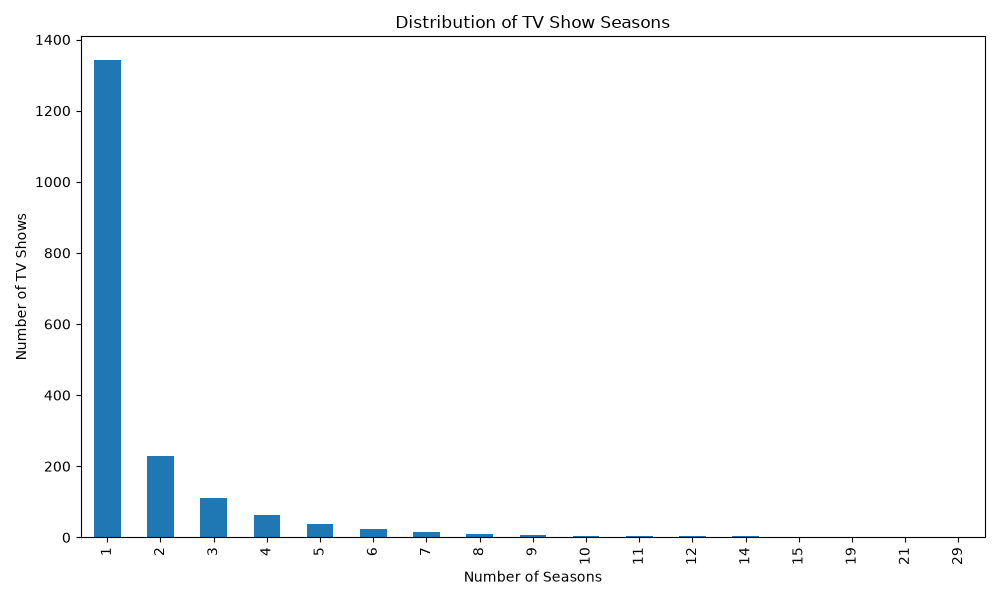
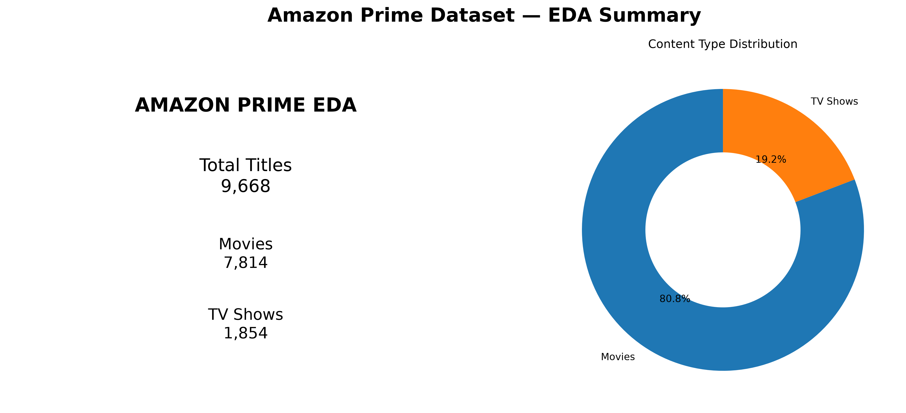

# Amazon Prime — Exploratory Data Analysis (EDA)

## 📌 Project Overview

This project performs **Exploratory Data Analysis (EDA)** on an Amazon Prime dataset to understand the distribution, patterns, trends, and characteristics of available movies and TV shows.

The analysis was completed as part of **Task 2: Exploratory Data Analysis** for the SWYNEX Technologies internship.

The dataset was obtained from **Kaggle** and analyzed using **Python, Pandas, and Matplotlib**.

---

## 🎯 Objectives

The main objectives of this project are:

- Understand the structure of the dataset
- Analyze Movies vs TV Shows
- Identify missing values and duplicate records
- Analyze content by release year
- Explore content ratings
- Identify frequently occurring genres/categories
- Analyze movie duration
- Analyze TV show seasons
- Identify useful trends, patterns, and anomalies
- Present findings using visualizations

---

## 🛠️ Technologies Used

- **Python**
- **Pandas** — Data loading and analysis
- **Matplotlib** — Data visualization
- **VS Code** — Development environment
- **GitHub** — Project documentation and version control

---

## 📂 Dataset

The dataset contains information about Amazon Prime titles.

### Dataset Details

- **Total Records:** 9,668
- **Total Columns:** 11
- **Movies:** 7,814
- **TV Shows:** 1,854
- **Duplicate Records:** 0
- **Missing Director Values:** 1
- **Release Year Range:** 1920–2021

### Main Columns

- `show_id`
- `type`
- `title`
- `director`
- `cast`
- `country`
- `release_year`
- `rating`
- `duration`
- `listed_in`
- `description`

---

## 🔍 Analysis Performed

### 1. Data Quality Analysis

The dataset was checked for:

- Missing values
- Duplicate records
- Data types
- Inconsistent or unusual values

The dataset contains **1 missing director value** and **no duplicate records**.

---

### 2. Movies vs TV Shows

The dataset contains:

- **7,814 Movies (80.82%)**
- **1,854 TV Shows (19.18%)**

This shows that movies represent the larger share of titles in the dataset.

---

### 3. Release Year Analysis

The number of titles was analyzed across release years.

The highest number of titles was recorded for:

- **2021 — 1,442 titles**
- **2020 — 962 titles**
- **2019 — 929 titles**

This helps identify the distribution of titles across different release years.

> Note: `release_year` represents the title's release year and should not be interpreted as the year the title was added to Amazon Prime.

---

### 4. Rating Analysis

The most frequently occurring ratings include:

- **13+ — 2,117 titles**
- **16+ — 1,547 titles**
- **ALL — 1,268 titles**
- **18+ — 1,243 titles**
- **R — 1,010 titles**

This provides an overview of the content-rating distribution in the dataset.

---

### 5. Genre / Category Analysis

The most frequently occurring categories include:

| Category | Number of Titles |
|---|---:|
| Drama | 986 |
| Comedy | 536 |
| Drama, Suspense | 399 |
| Comedy, Drama | 377 |
| Animation, Kids | 356 |
| Documentary | 350 |
| Kids | 334 |
| Action, Drama | 297 |

This indicates that drama-related categories appear frequently in the dataset.

---

### 6. Movie Duration Analysis

Movie durations were converted from text format into numerical minutes.

Results:

- **Average Movie Duration:** 91.31 minutes
- **Median Movie Duration:** 91 minutes

A histogram was created to understand the distribution of movie durations.

---

### 7. TV Show Season Analysis

TV show duration values were converted into the number of seasons.

Results:

- **Average:** approximately 1.72 seasons
- **Median:** 1 season
- **Maximum:** 29 seasons

The analysis shows that many TV shows in the dataset have a relatively small number of seasons.

---

## 📊 Visualizations

The project includes the following visualizations:

### Release Year Distribution



### Movies vs TV Shows



### Content Ratings



### Top Genres



### Movie Duration Distribution



### TV Show Season Distribution



### Final EDA Summary



---

## 💡 Key Insights

1. **Movies dominate the dataset**, accounting for approximately 80.82% of all titles.

2. **2021 has the highest number of titles by release year**, with 1,442 titles.

3. **Drama is the most frequently occurring category**, with 986 titles.

4. **13+ is the most common content rating**, with 2,117 titles.

5. **The average movie duration is approximately 91 minutes**, with a median of 91 minutes.

6. **TV shows generally contain fewer seasons**, with the median number of seasons being 1.

7. **The dataset contains 1 missing director value and no duplicate records**, while some unusual placeholder-like records were observed during data inspection.

---

## ⚠️ Data Quality Observations

During exploratory analysis, a small number of unusual records containing placeholder-like values were observed.

These records were treated as **data anomalies for analysis purposes** rather than being silently removed.

This helps maintain transparency about the original dataset.

---

## 📁 Project Structure

```text
Amazon-Prime-EDA/
│
├── data.csv
├── amazon_prime_eda.py
├── README.md
│
├── release_year.png
├── content_type.png
├── ratings.png
├── genres.png
├── movie_duration.png
├── tv_show_seasons.png
└── final_eda_summary.png
